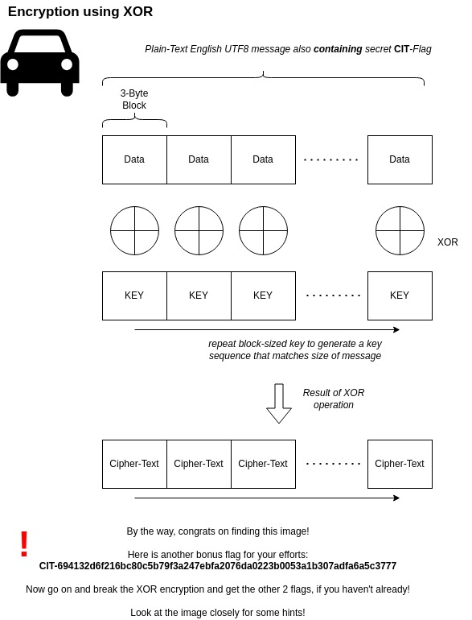

# Methodology

## 1. Phase: Inspecting the challenge

The challenge states that Fabulous Mobility uses a XOR-based encryption scheme and provides two encrypted messages on the [`Confidentiality`](https://security-challenge.bmw-carit.de/fabulousmobility/confidentiality) page. Also a small hint is to be found in the `Confidentiality` page.

---

## 2. Phase: Finding the hidden hint

Inspecting the page source revealed a referenced JavaScript file:

```html
<div class="px-4 py-5 my-5 text-center">
    <script src="/static/js/header.js"></script>
    <h1 class="display-6 fw-bold">Trust us with your Confidential Data!</h1>
</div>
```

Inside the JavaScript code, a function called `egami_wohs()` exists.

Running the function inside the browser console on the challenge page, reveals the following hidden image with details about the encryption:



- encryption uses XOR
- key length is 3 bytes
- plaintext is UTF-8 English
- plaintext contains a `CIT-Flag`

---

## 3. Phase: Inspecting the ciphertext format

Two ciphertexts are provided:

```
cx4jeE13FgUyYh4yIR8yNk0xLgwwYgQkYi4eFkBmJgtnJloxJ1gydVRicA42JltnIQg0J181I19idA41dFhmJF9ic1xlIQlhe10xJ1s2c11vdVVmJFVlcgljcwwy
cAMzeE13ASQDb1RjdVgxe1VudVliI1tiIwtjJw5hcV9jclk2Jl0zdw8zdQgxdw41dQk2dVxicFphdVtlJlRidwhvdFUyelk0IA93Kx53NgUyYh4yIR8yNk0xLgww
```

The ciphertext only contains characters from the Base64 alphabet, indicating that the ciphertext was Base64-encoded before.

---

## 4. Phase: Decoding the ciphertext

The hidden image confirms that the encryption uses a repeating 3-byte XOR key.

Because the flag format is known, the plaintext fragment `"CIT"` can be used as a known plaintext value.

The approach is:
- slide `"CIT"` across every possible plaintext position
- reconstruct the corresponding 3-byte XOR key candidate
- decrypt the full ciphertext using the reconstructed repeating key
- search the resulting plaintext for a valid flag pattern

Once a valid flag appears, the correct XOR key has been recovered.

---

## Flags

```text
CIT-1df0d7fe5e7952cad60cece2ba256cb651f25112cd690fe6a108781f820d41ae
```

```text
CIT-9475f989745a65af4ec632404ad0d5bd7ef5cb7da715276762d955e868e84cbb
```

```text
CIT-694132d6f216bc80c5b79f3a247ebfa2076da0223b0053a1b307adfa6a5c3777
```
